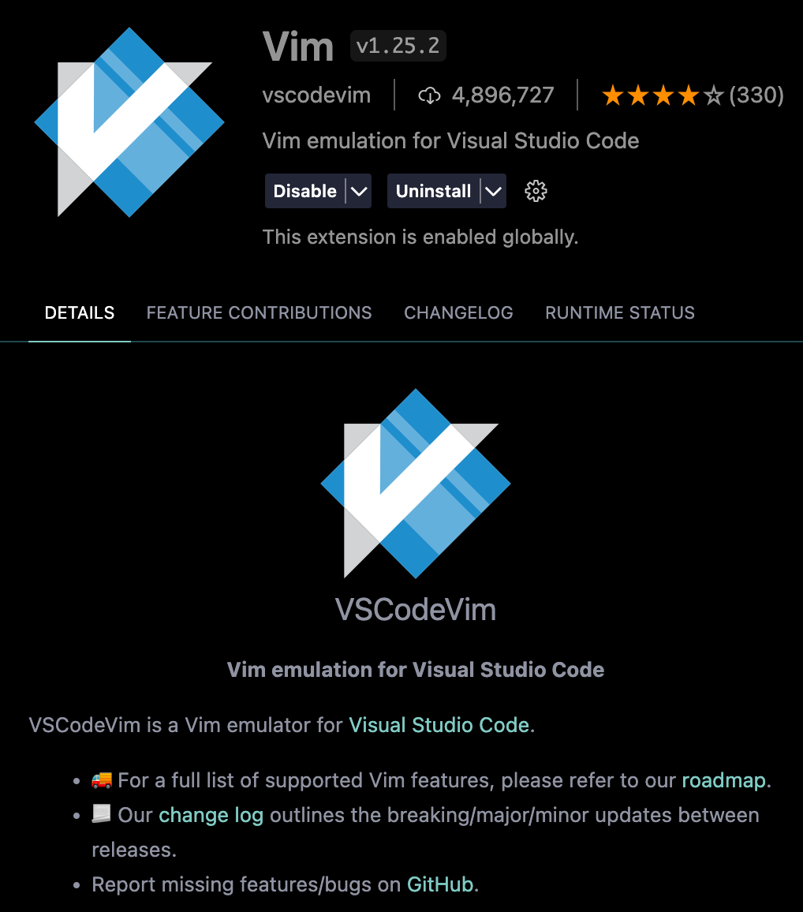
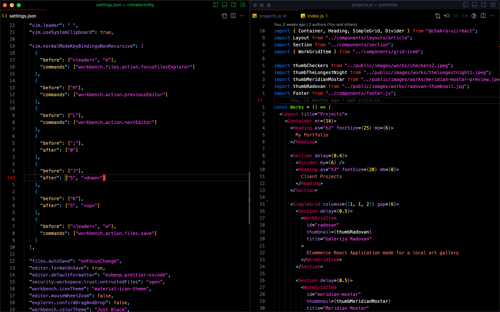

# VIM Emulator Config for VS Code

🎉 Welcome to my custom VIM emulator config for VS Code! 🎉

This config is designed to help you boost your productivity by providing some custom keybindings and settings to make your VIM experience smoother.

## Getting Started

### Step 1: Install the VIM Emulator Extension

First, you'll need to install the VIM Emulator extension from the [Visual Studio Marketplace](https://marketplace.visualstudio.com/items?itemName=vscodevim.vim).

### Step 2: Replace Global Settings

```json
{
  "workbench.colorCustomizations": {
    "editor.background": "#000000",
    "editor.lineHighlightBackground": "#1073cf00",
    "editor.lineHighlightBorder": "#9fced11f",
    "tab.activeBorderTop": "#ff0000",
    "editorCursor.foreground": "#ff0000",
    "editorLineNumber.activeForeground": "#ff0000",
    "editorLineNumber.foreground": "#767676"
  },
  "editor.tokenColorCustomizations": {
    "textMateRules": [
      {
        "scope": [
          // here you can apply your custom font styling
        ],
        "settings": {
          "fontStyle": ""
        }
      }
    ]
  },

  // VIM config
  "vim.leader": " ",
  "vim.useSystemClipboard": true,

  "vim.normalModeKeyBindingsNonRecursive": [
    {
      "before": ["<leader>", "e"],
      "commands": ["workbench.files.action.focusFilesExplorer"]
    },
    {
      "before": ["H"],
      "commands": ["workbench.action.previousEditor"]
    },
    {
      "before": ["L"],
      "commands": ["workbench.action.nextEditor"]
    },
    {
      "before": [";"],
      "after": ["0"]
    },
    {
      "before": ["J"],
      "after": ["5", "<down>"]
    },
    {
      "before": ["K"],
      "after": ["5", "<up>"]
    },
    {
      "before": ["<leader>", "w"],
      "commands": ["workbench.action.files.save"]
    }
  ],

  "files.autoSave": "onFocusChange",
  "editor.formatOnSave": true,
  "editor.defaultFormatter": "esbenp.prettier-vscode",
  "security.workspace.trust.untrustedFiles": "open",
  "workbench.iconTheme": "material-icon-theme",
  "editor.mouseWheelZoom": false,
  "explorer.confirmDragAndDrop": false,
  "workbench.colorTheme": "Just Black",

  "workbench.sideBar.location": "right",

  "breadcrumbs.enabled": false,
  "workbench.editor.pinnedTabSizing": "compact",
  "workbench.editor.tabSizing": "shrink",
  "workbench.enableExperiments": false,
  "workbench.settings.enableNaturalLanguageSearch": false,
  "update.showReleaseNotes": false,

  "editor.cursorSurroundingLines": 16,
  "editor.wordWrap": "off",
  "diffEditor.wordWrap": "off",
  "editor.fontSize": 13,
  "terminal.integrated.fontSize": 13,
  "editor.semanticHighlighting.enabled": true,
  "editor.accessibilitySupport": "off",
  "terminal.integrated.fontFamily": "Menlo for Powerline, PowerlineSymbols",
  "settingsSync.ignoredSettings": ["editor.guides.indentation"],
  "search.searchOnType": false,
  "editor.scrollbar.horizontalScrollbarSize": 4,
  "editor.scrollbar.verticalScrollbarSize": 4,
  "workbench.editor.enablePreview": false,
  "editor.lineNumbers": "relative",
  "workbench.statusBar.visible": false,
  "workbench.activityBar.visible": false,
  "editor.minimap.enabled": false
}
```



Next, you'll need to replace the global `settings.json` file with the one provided in this repo. This file contains some custom settings that will optimize your VIM experience. You can do this by following these steps:

1. Open VS Code
2. Click on the "File" menu in the top left corner
3. Click on "Preferences"
4. Click on "Settings"
5. In the search bar, search for "settings.json"
6. Click on the "Edit in settings.json" button
7. Replace the contents of the file with the contents of `settings.json` from this repo
8. Save the file

### Step 3: Replace Global Keybindings

```json
// Place your key bindings in this file to override the defaultsauto[]
[
  {
    "key": "shift+j",
    "command": "selectNextSuggestion",
    "when": "suggestWidgetMultipleSuggestions && suggestWidgetVisible && textInputFocus"
  },
  {
    "key": "shift+k",
    "command": "selectPrevSuggestion",
    "when": "suggestWidgetMultipleSuggestions && suggestWidgetVisible && textInputFocus"
  },
  {
    "key": "alt+f",
    "command": "workbench.action.focusSideBar"
  },
  {
    "key": "cmd+e",
    "command": "workbench.action.toggleSidebarVisibility"
  },
  {
    "key": "cmd+b",
    "command": "workbench.action.toggleActivityBarVisibility"
  },
  {
    "key": "cmd+0",
    "command": "-workbench.action.focusSideBar"
  },
  {
    "key": "cmd+t",
    "command": "workbench.action.terminal.toggleTerminal"
  },
  {
    "key": "ctrl+;",
    "command": "workbench.files.action.collapseExplorerFolders",
    "when": "explorerViewletVisible"
  },
  {
    "key": "cmd+b",
    "command": "-workbench.action.toggleSidebarVisibility"
  },
  {
    "key": "cmd+1",
    "command": "workbench.action.openEditorAtIndex1"
  },
  {
    "key": "cmd+2",
    "command": "workbench.action.openEditorAtIndex2"
  },
  {
    "key": "cmd+3",
    "command": "workbench.action.openEditorAtIndex3"
  },
  {
    "key": "cmd+4",
    "command": "workbench.action.openEditorAtIndex4"
  },
  {
    "key": "cmd+5",
    "command": "workbench.action.openEditorAtIndex5"
  },
  {
    "key": "cmd+6",
    "command": "workbench.action.openEditorAtIndex6"
  },
  {
    "key": "cmd+7",
    "command": "workbench.action.openEditorAtIndex7"
  },
  {
    "key": "cmd+8",
    "command": "workbench.action.openEditorAtIndex8"
  },
  {
    "key": "cmd+9",
    "command": "workbench.action.openEditorAtIndex9"
  },
  {
    "key": "c",
    "command": "filesExplorer.copy",
    "when": "explorerViewletFocus && filesExplorerFocus && !inputFocus"
  },
  {
    "key": "p",
    "command": "filesExplorer.paste",
    "when": "explorerViewletFocus && filesExplorerFocus && !inputFocus"
  },
  {
    "key": "r",
    "command": "renameFile",
    "when": "explorerViewletFocus && filesExplorerFocus && !inputFocus"
  },
  {
    "key": "shift+a",
    "command": "explorer.newFolder",
    "when": "explorerViewletFocus && filesExplorerFocus && !inputFocus"
  },
  {
    "key": "a",
    "command": "explorer.newFile",
    "when": "explorerViewletFocus && filesExplorerFocus && !inputFocus"
  }
]
```

Now, you'll need to replace the global `keybindings.json` file with the one provided in this repo. This file contains some custom keybindings that will make your VIM experience even smoother. You can do this by following these steps:

1. Open VS Code
2. Click on the "File" menu in the top left corner
3. Click on "Preferences"
4. Click on "Keyboard Shortcuts"
5. In the search bar, search for "keybindings.json"
6. Click on the "Edit in keybindings.json" button
7. Replace the contents of the file with the contents of `keybindings.json` from this repo
8. Save the file

### Step 4: Make a Backup

Before you start using this config, please make a backup of your existing settings and keybindings files, in case you need to revert back to them later.

## Recommended Color Scheme

To get the best VIM experience with this config, we recommend using the "Just Black" color scheme for VS Code. You can install this color scheme by following these steps:



1. Open VS Code
2. Click on the "Extensions" icon in the left-hand menu
3. Search for "Just Black" in the search bar
4. Click on the "Install" button next to the "Just Black" extension
5. Once installed, click on the "Color Theme" icon in the bottom left corner
6. Select "Just Black" from the list of available color schemes

#### Keyrepeat problems?

### Mac

To enable key-repeating, execute the following in your Terminal, log out and back in, and then restart VS Code:

```sh
$ defaults write com.microsoft.VSCode ApplePressAndHoldEnabled -bool false              # For VS Code
$ defaults write com.microsoft.VSCodeInsiders ApplePressAndHoldEnabled -bool false      # For VS Code Insider
$ defaults write com.visualstudio.code.oss ApplePressAndHoldEnabled -bool false         # For VS Codium
$ defaults write com.microsoft.VSCodeExploration ApplePressAndHoldEnabled -bool false   # For VS Codium Exploration users
$ defaults delete -g ApplePressAndHoldEnabled                                           # If necessary, reset global default
```

We also recommend increasing Key Repeat and Delay Until Repeat settings in _System Preferences -> Keyboard_.

### Windows

Like real vim, VSCodeVim will take over your control keys. This behaviour can be adjusted with the [`useCtrlKeys`](#vscodevim-settings) and [`handleKeys`](#vscodevim-settings) settings.

## Conclusion

That's it! You should now be all set up to start using this custom VIM emulator config for VS Code. If you have any questions or issues, please feel free to [open an issue](https://github.com/your-repo-name-here/issues/new) in this repo. Happy coding! 😊
